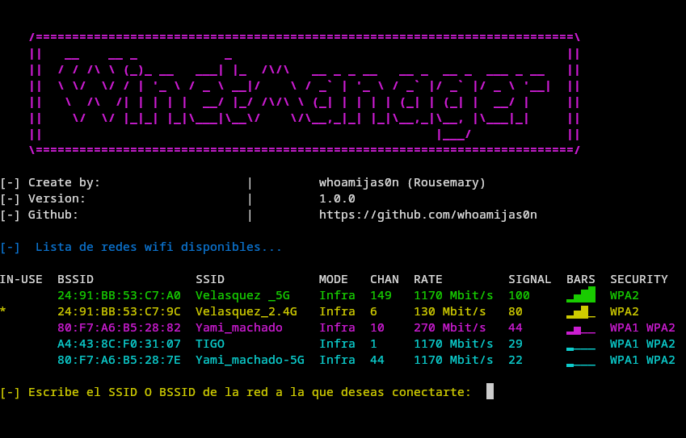

# Wifi_connection_NetworkManager
Script para establecer una conexion de red Wifi en sistemas GNU/Linux a traves de NetworkManager

<p align="center">
  
</p>

## Requisitos
Tienes que tener instalado el paquete NetworkManager para utilizar este script.
si no lo tienes instalado ejecuta los siguientes comandos segun la distribucion que utilices:
### Arch Linux / Manjaro
```bash
sudo pacman -Syu networkmanager
sudo systemctl enable --now NetworkManager
```
### Debian / Ubuntu / Kali Linux
```bash
sudo apt update
sudo apt install network-manager
sudo systemctl enable --now NetworkManager
```
### Fedora / RHEL / CentOS
```bash
sudo dnf install NetworkManager
sudo systemctl enable --now NetworkManager
```
## Modo de uso
en tu terminal de preferencia, ejecuta los siguientes comandos:
```bash
git clone https://github.com/whoamijas0n/Wifi_connection_NetworkManager
cd Wifi_connection_NetworkManager
bash wifi_connect.sh
```
Para volver a utilizarlo simplemente vuelve a ejecutar:
```bash
bash wifi_connect.sh
```


